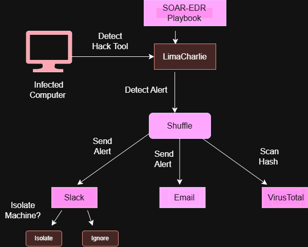

# SOAR-EDR-Project

I developed an automated Incident Response (SOAR) workflow using Shuffle for automation he processing of security alerts generated by LimaCharlie (EDR).

Key Technical Steps:

Detection & Trigger: The workflow starts with a Webhook trigger from LimaCharlie with a hack tool called Lazagne which used to retrieve lots of passwords stored in the local machine, so LimaCharlie is specifically capturing detection events such as malicious tools.

Threat Enrichment: Upon receiving the alert, the workflow automatically extracts file indicators like the file hash of the alers and queries the VirusTotal v3 API to check its reputation and get analysis statistics and flag it either malicious or not.  

Notification & Action: Finally, the enriched security report is automatically pushed to communication channels like Slack or Email, enabling SOC analysts to see the exact malicious score instantly and respond without manual delays.   

Archiitecture Design for the Project:

